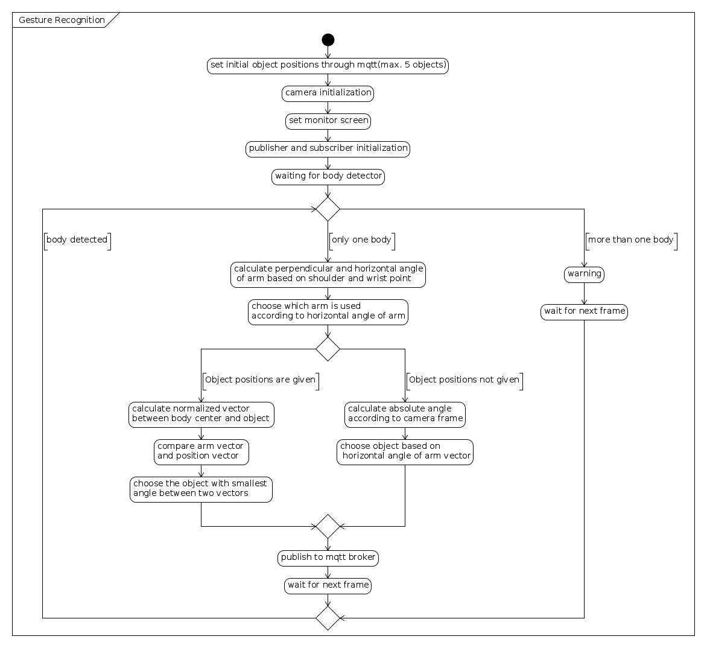

# gesture_recognition

This project uses Orbbec Astra SDK to detect arm gesture to determin which object the user is pointing to.
x-positive direction:  Right


**If license expires please download the latest sdk from Orbbec.**

**Broker Address**: broker.hivemq.com  // 192.168.178.33

**Subscribe to topic**: intensechoi/camera/set    format: {"obj1":[x,y],"obj2":[x,y],....} max. 5 objects

**Publish to topic**: intensechoi/camera/get      format: {"result":ObjectX , "timestamp":xxx}
 


**Full Install Instruction**
```
ssh turtlebot@192.168.178.25  (under intensechoi network)
cd pointing-direction/build
export DISPLAY=:0
./Gesture_recognition
```


 ## Activity Graph

